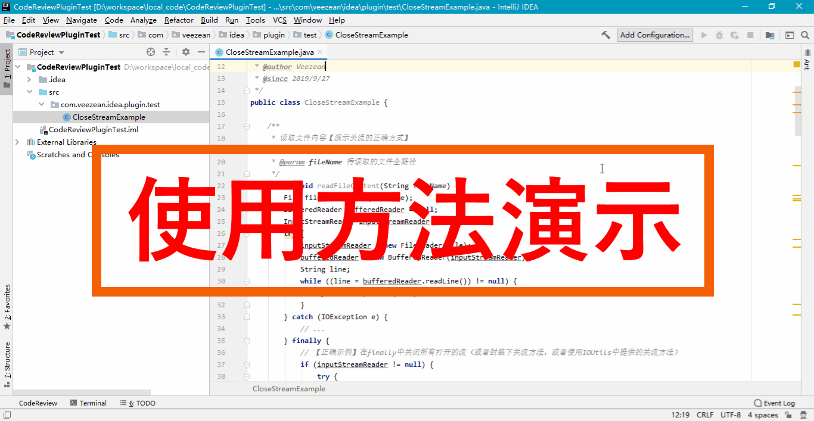
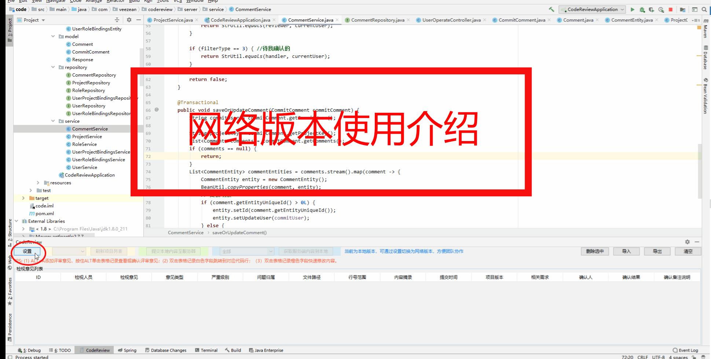
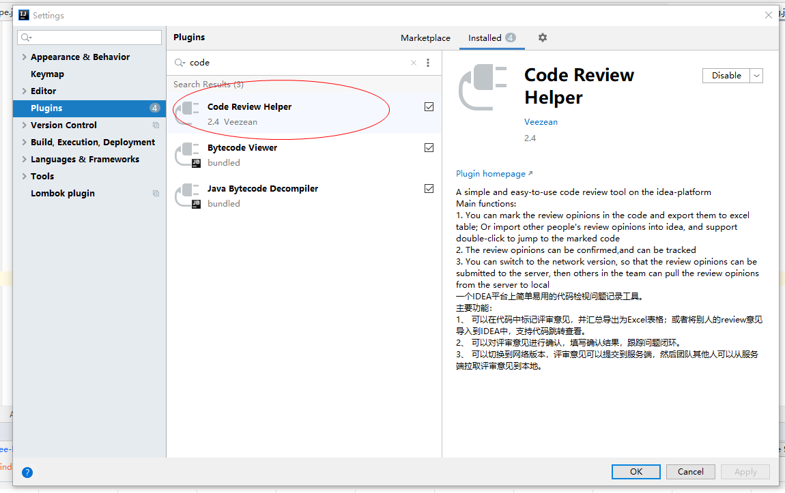
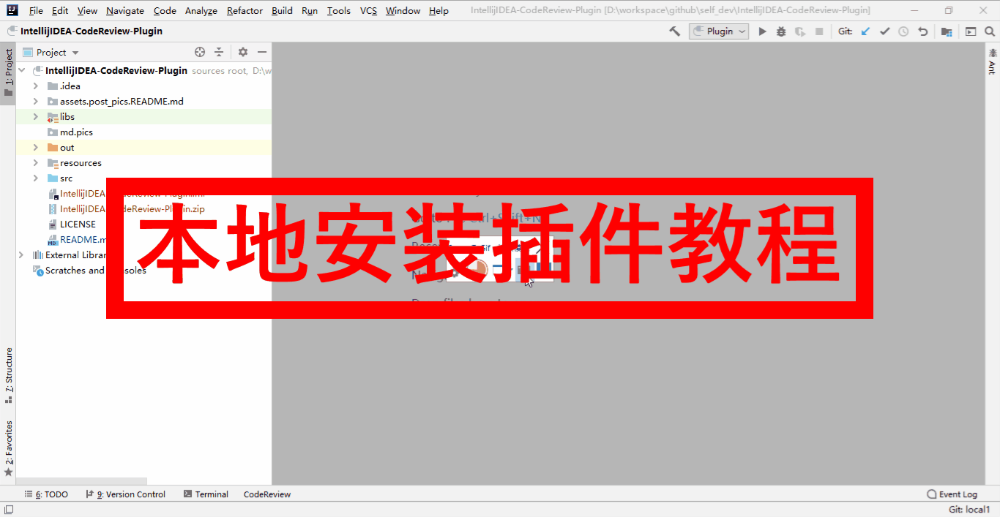

# Intellij IDEA代码检视插件/ Intellij IDEA CodeReview Plugin

**写在前面的话：**

> 这是一个业余时间写的Intellij IDEA的一个Code Review代码检视、代码评审的插件。当初开发的时候也仅是按照自己的习惯，写了这么个插件来辅助工作中的代码检视事务。没想到能得到这么多小伙伴的支持、最近抽空优化了下相关功能，加了个很多小伙伴提出的网络交互能力，希望能帮到大家~~

---

最近在搞代码Review，一直想找个简单易用、适合自己习惯的`Intellij IDEA`的代码检视插件，但是一直没找到，所以索性自己写了一个来方便使用。

借助此插件，可以`方便的在本地IDEA工具里面记录代码检视发现的问题或者需要备注的信息`，同时`支持将IDEA中的评审意见导出为Excel表格`，方便发送给其它同事导入到自己的IDEA中，实现双击跳转到对应的代码位置，进行问题的确认。

> **新版介绍** 
> 
> 新版本V3.x对插件的实现进行了大幅度的重构，优化了众多细节处理，更加注重了通用化与定制化的支持。
> 1. 支持了评审字段的自定义支持，您可以在界面中修改相关配置，使其更加符合您的使用诉求
> 2. 提供了久违了的全新的前后端一体化配套服务端，并对插件的网络版本能力进行了全新重构，现在您可以基于插件进行更加高效的团队协作体验
> 3. 提供了更加便捷的使用文档获取途径


**主要功能：**
  * Alt+A快速添加注释
  * 行号旁边图标标识有检视意见的位置
  * 支持双击评审意见跳转到代码对应位置
  * 支持对评审意见的删除、修改
  * 支持评审意见内容导出为Excel表格
  * 支持将导出的Excel表格中的评审意见导入到IDEA中进行查看与管理。
  * 支持网络交互，适合团队协作场景使用（V2.0版本新增）
  * 支持了自定义评审字段


**使用方法&效果图演示如下：**

常规用法




网络版本用法：




**安装方法**

***通过市场安装（推荐）***

目前，本插件已经提交到IDEA的Marketplace中，您可以通过`IDEA--settings--plugins`窗口，输入`code review`关键字，搜索到本插件，然后点击安装即可，后续有新版本也可以快捷一键更新。



***本地安装***

自行clone本仓库代码进行编译，或者直接从release目录下，下载已编译好的对应的插件版本，然后按照下面方法进行安装。

```
导航到 File | Settings | Plugins 页面，点击 Install plugin from disk
```




**配套服务端**

如果需要私有化服务端管理评审意见，可以部署自己的网络版本配套的服务端，参见如下地址获取：

[github仓库地址](https://github.com/veezean/CodeReviewServer)

[gitee仓库地址](https://gitee.com/veezean/CodeReviewServer)

**功版本变更记录：**

* **V3.0.1版本，2023-03-15更新：**
  1. bug修复<br>

* **V3.0版本，2023-03-12更新：**
  1. 对插件实现架构进行全面重构，支持配置化实现界面与字段的调整，方便个性化定制<br>
  2. 简化代码实现，删减大量冗余逻辑<br>
  3. 优化大量细节实现逻辑，提升使用体验<br>
  4. 对接新版本服务端，提供完善的团队协作体验<br>

* **V2.4版本，2021-06-14更新：**
  1. 网络版本支持使用gitee作为服务端，支持直接将评审意见创建为GITEE的issue。<br>
  2. 提交IDEA plugin市场，要求必须英文界面，所有更改下语言界面显示。<br>
  3. 优化界面耗时操作逻辑，在子线程中操作，避免界面卡顿。<br>
  4. 优化部分lib依赖，大幅降低插件大小。<br>

* **V2.0版本，2021-05-01更新：**
  1. 增加了好久前承诺要做的网络版本（配合服务端一起）
  2. 使用体验优化了下
  3. 解决了几个bug

* **V1.3版本，2021-04-24更新：**
  1. 部分已知bug修复
  2. 增加处理人、关联需求、关联版本等字段
  3. 代码优化

* **V1.2版本，2019-12-07更新：**
  1. 删除、清空等操作增加二次确认，防止误操作
  2. 优化左侧行标定位逻辑的精准度

* **V1.1版本，2019-10-08更新：**
  1. 项目维度独立开，同时打开多个IDEA的时候，相互review的内容互不干扰

* **V1.0版本，2019-10-04更新：**
  1. 支持Alt+A快速添加选中代码部分的评审意见
  2. 支持添加了评审意见的地方，在代码的左侧窗口行号旁边显示一个图标标识
  3. 支持双击评审意见，直接跳转到代码对应位置
  4. 支持评审意见导出Excel表格
